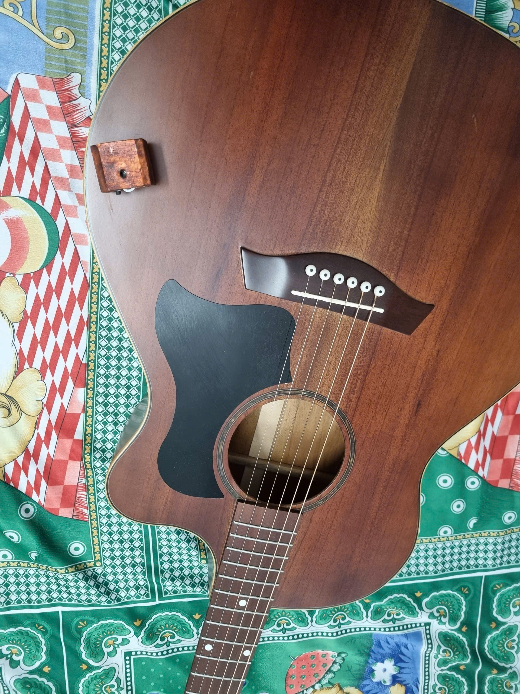
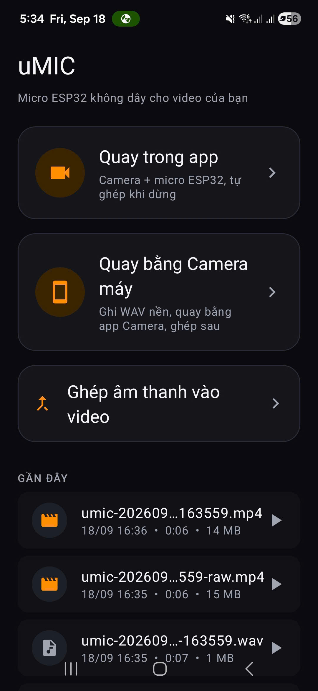

# Guitar DIY

**Guitar DIY** là dự án dành cho người đam mê guitar và thích tự làm đồ điện tử: tự tay làm một món đồ của riêng mình để chơi cùng cây đàn.
Sản phẩm đầu tiên của dự án là **uMIC** — micro WiFi ESP32-S3 + app Android quay video có tiếng đàn thu từ mic ngoài, tự động khớp tiếng với hình.

<p align="center">
  
  
</p>

Bài giới thiệu + hướng dẫn đầy đủ (tiếng Việt): [docs/blog/guitar-diy-umic-gioi-thieu-va-huong-dan.md](docs/blog/guitar-diy-umic-gioi-thieu-va-huong-dan.md). File nạp sẵn (APK + firmware): [Releases](https://github.com/nguyminhdc78-del/guitar-diy/releases).

## uMIC: ESP32-S3 WiFi Microphone + Android Recorder

Record synchronized audio and video using an ESP32-S3 microphone (48 kHz PCM over WiFi) with two modes:
1. **Mode 2 (In-app):** Full-screen CameraX preview + simultaneous in-app merge when stopped
2. **Mode 1 (External):** Stock Camera + manual merge flow

Both modes support manual offset fine-tuning or automatic clap-based sync.

## Hardware Setup

**BOM:**
- ESP32-S3-N16R8 devkit (16 MB flash, 8 MB Octal PSRAM) or FH4R2 variant
- INMP441 I2S microphone module
- Momentary push button (GPIO7 ↔ GND, optional for v0.2+)
- **Electrolytic capacitor 100–470 µF (≥ 6.3 V)** soldered across the INMP441 VDD/GND pads (required, see below)
- 5 male-to-female jumper wires
- USB cable (data + power)
- Android 10+ phone (Samsung One UI recommended)

**Wiring (INMP441 → ESP32-S3):**
```
INMP441 Pin     │ ESP32-S3 Pin
────────────────┼──────────────
SCK             │ GPIO 3
WS              │ GPIO 4
SD              │ GPIO 5
L/R (select)    │ GND        (left channel)
VDD             │ 3V3
GND             │ GND

Required: Supply Decoupling (v0.2.1)
────────────────────────────────────
470µF (+) long leg │ INMP441 VDD pad   ← same pads as the 3V3/GND wires,
470µF (−) stripe   │ INMP441 GND pad      legs ≤ 5 mm, optional 103/104 ceramic in parallel
Without it WiFi TX bursts modulate the mic supply: 50 Hz buzz (20 ms frames) + ~10 Hz thumps (beacons).
Measured 2026-09-18: noise gone after fitting the capacitor; mic-signal-monitor glitches stopped.

Optional: Momentary Button
─────────────────────────
Push Button     │ ESP32-S3 Pin
────────────────┼──────────────
One terminal    │ GPIO 7
Other terminal  │ GND
```

## Toolchain Setup

### PlatformIO (Firmware)

```powershell
# Install PlatformIO Core via pip
python -m pip install --upgrade platformio

# Note: Do NOT use Git Bash for pio commands; use PowerShell.
# pio uses Arduino core 3.x (pioarduino platform, not official espressif32).
# Run from firmware/ directory in the commands below.
```

### Android SDK (App)

```powershell
# Install JDK 17 (required for compileSdk 36)
# Download and install from https://adoptium.net/ or use choco/scoop

# Install Android SDK command-line tools
# Download cmdline-tools from https://developer.android.com/studio/command-line-tools
# Extract and set up as %ANDROID_HOME%\cmdline-tools\latest

# Create local.properties in android/ directory:
# Replace YOURPATH with actual Android SDK path
echo "sdk.dir=C:\Users\YourUsername\AppData\Local\Android\sdk" > android\local.properties

# Install SDK packages (run once)
%ANDROID_HOME%\cmdline-tools\latest\bin\sdkmanager.bat "platform-tools" "platforms;android-36" "build-tools;36.0.0"
```

## Flash & Test Firmware

```powershell
# Test VU meter (no WiFi, serial output only)
cd firmware
python -m platformio run -e vu-test -t upload
python -m platformio device monitor

# Flash production firmware (SoftAP + TCP streaming)
python -m platformio run -e mic -t upload
python -m platformio device monitor
```

**LED Indicator (v0.2.0):**
- **Dim white** – booting
- **Blue blink** – idle, waiting for WiFi client
- **Green** – streaming audio to client
- **Solid red** – recording (phone confirmed)
- **White flash** – dropped frame detected
- **Amber flash** – button press acknowledged
- **Magenta blink** – no usable mic signal (v0.2.1): check INMP441 L/R→GND, SD→GPIO5, VDD→3V3, GND; app shows "Mic không có tín hiệu"

## Desktop Test Client

```powershell
# Connect your PC to WiFi SSID "uMIC", passphrase "umic12345"
cd firmware
python tools\stream-to-wav.py --seconds 30 --out capture.wav
# Verify capture.wav in Audacity (48 kHz, 16-bit mono)
```

## Build & Install Android App

```powershell
# Build debug APK
cd android
.\gradlew.bat :app:assembleDebug

# Install to connected device
.\gradlew.bat :app:installDebug

# Or use adb directly
adb install app\build\outputs\apk\debug\app-debug.apk
```

## Recording Workflows

### Mode 2 (In-App): Full-Bleed Camera + Auto-Merge
1. **Power ESP32** → wait for blue blink
2. **Open uMIC app** → tap "Quay trong app" → accept WiFi + permissions
3. **Chip shows "Đã nối micro"** (standby connected to ESP32)
4. **Tap REC FAB** → camera preview fills screen, timer starts
5. **Press physical button (GPIO7) or tap timer** → toggle start/stop
6. **Level meter overlay** shows audio levels in real-time
7. **Tap STOP** → auto-merge starts; status chip shows progress
8. **Result saved to `Movies/uMIC/umic-<ts>.mp4`**

If sync is low confidence, raw `umic-<ts>-raw.mp4` is kept for manual merge.

### Mode 1 (External): Stock Camera + Manual Merge
1. **Power ESP32** → wait for blue blink
2. **Open uMIC app** → tap "Quay bằng Camera máy" → accept WiFi
3. **Open stock Camera app** (uMIC runs in background, app keeps screen on)
4. **Clap once** (sync reference)
5. **Film your take** (uMIC shows live level meter)
6. **Tap DỪNG** in uMIC
7. **App → Ghép → pick video → auto-sync → Nghe thử → Ghép**
8. **Merged MP4 saved to `Movies/uMIC/`**

**File locations:**
- WAV: `Music/uMIC/*.wav`
- MP4: `Movies/uMIC/*.mp4`

## Microphone Placement Tips

The **INMP441 acoustic port** (small hole on PCB back) captures sound directionally. For best results:
- **Outside guitar body** (inside = +5 dB boom 60–250 Hz, −10…−13 dB at 1–4 kHz vs phone mic)
- **30–50 cm from 12th fret**, port facing the strings
- **Port not covered** (avoid foam directly over the hole)

Inside-body placement is boomy and dull; recommend external placement for clarity.

## Standby Behavior (v0.2.0+)

After connecting in Mode 2 or Mode 1:
- **Chip shows "Đã nối micro"** → uMIC keeps WiFi + control channel active
- **Screen stays on** → prevents foreground service kill
- **Button presses wake recording** → press GPIO7 or tap FAB to start
- **Screen hidden** → connection drops; must reconnect to re-arm

## Troubleshooting

| Issue | Cause | Fix |
|-------|-------|-----|
| Button not reacting | No active connection | Check chip shows "Đã nối micro"; or heartbeat timeout (15 s idle drop on both sides) |
| ESP32 reboots while idle | USB console blocking interrupts | Use `-D ARDUINO_USB_CDC_ON_BOOT=1 -D ARDUINO_USB_MODE=1` (pioarduino only) |
| No serial output | UART vs native USB | Use UART/COM port if available; or use USB flags above |
| All-zero audio (-96 dBFS) | Microphone not wired | Check MIC_PIN_* wiring; tune MIC_SHIFT_BITS in vu-test |
| WiFi dialog rejected | Android rejects specifier | Toggle "WiFi thủ công" → manually select "uMIC" SSID |
| High drop count | Too far from ESP32 | Stay within 10 m; disable Adaptive Battery in Samsung One UI |
| HDR/Dolby Vision merge fails | Phone encodes HEVC+HDR10+ | Disable HDR in Camera Settings → Advanced |
| Recordings not in picker | App data cleared | Older WAVs stay in `Music/uMIC` (manual re-import not supported in v0.2) |
| In-app sync low confidence | Weak clap or background noise | Use "+1 s / −1 s" buttons; hold to keep `umic-<ts>-raw.mp4` |

**Samsung One UI Battery Settings:**
- Settings → Battery → Background usage limits → Add uMIC to "Never sleeping apps"
- Settings → Battery → Adaptive battery → Turn OFF

## Known Limits (v0.2.0)

- **Drift:** ~45 ms / 15 min (no sub-sample correction; Mode 2 uses clock-anchored ±1.5 s with PSR/Pearson rules)
- **Single client:** One phone per ESP32 AP session
- **No original audio:** Merged MP4 contains only ESP32 track (feature backlog)
- **Control channel heartbeat:** Phone pings every 5 s; 15 s idle drop on both sides
- **AAC pre-roll:** 2048 samples (42.7 ms) FDK delay, compensated via `OffsetPcmSource`
- **Preview latency:** ~20–80 ms due to AudioTrack; merge is sample-exact
- **Foreground service:** Screen on required in Mode 1 (degrades behind Camera app)
- **Level meter:** Samples per 100 ms frame (peaks between samples missed)
- **AP passphrase:** Change requires `-D AP_PASS='"..."'` + `StreamProtocol.AP_PASSPHRASE` edit

---

**UI Language:** Vietnamese (code & docs in English)  
**Default Network:** SSID "uMIC", WPA2 "umic12345", channel 6 @ 192.168.4.1:5000

**Security Note:** The AP passphrase is public by default. To override for shared spaces, modify the build flag in `platformio.ini` and update `AP_PASSPHRASE` in the Android app code.
